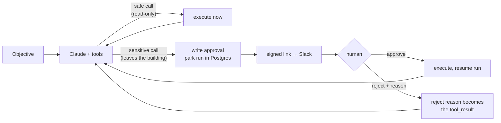

# AI Automation Blueprints

Production patterns for AI automation in small service businesses: **importable n8n
workflows** and a **TypeScript agent service with durable human-in-the-loop approval**.

Every piece here is written the way I ship client work — retries, error branches,
idempotency keys, tenant scoping, arithmetic checked in code rather than trusted to a
model, and a human gate in front of anything that leaves the building.

```
workflows/                        4 importable n8n workflows (55 nodes)
services/approval-gateway/        Claude tool-calling agent, Cloudflare Worker + TS
db/schema.sql                     Postgres/Supabase schema, RLS, expiry sweep
docs/                             architecture, failure modes, runbook, security
```

---

## Why this repo exists

Most AI automation demos work once, on a clean input, with someone watching. The
interesting engineering is everywhere else: the malformed webhook, the invoice whose
line items do not add up, the model that cites a document it never saw, the approval
nobody answers before the weekend.

Each artefact here is built around one of those problems.

| # | Workflow | The problem it actually solves |
|---|----------|-------------------------------|
| 01 | [Inbound quote request](workflows/01-inbound-quote-request.json) | Turn a free-text enquiry into a structured lead, then decide — in code, not in the prompt — whether a human must see it before anything goes out |
| 02 | [Supplier invoice → accounting](workflows/02-document-extraction-to-accounting.json) | Read a PDF natively, then **re-add the line items ourselves** and refuse to post if the model's totals disagree with its own extraction |
| 03 | [Knowledge assistant](workflows/03-knowledge-assistant-rag.json) | pgvector retrieval where every `[n]` citation is verified against the chunks actually supplied — a fabricated citation is caught, not shipped |
| 04 | [Automation health monitor](workflows/04-automation-health-monitor.json) | Group failures by workflow instead of one alert per execution, and escalate only on repetition — the difference between a monitored channel and a muted one |

And one service:

**[`services/approval-gateway`](services/approval-gateway)** — a Claude agent whose
tool calls are classified `safe` or `sensitive` **in code**. Sensitive calls park the
run in Postgres and wait for a signed, expiring approval link. The run resumes in a
different Worker isolate, possibly hours later. 62 tests, typecheck clean.

---

## The one idea worth stealing



Two details make this more than a diagram:

**Risk classification lives in the registry, not the prompt.** A system prompt saying
*"ask before sending email"* is a request. A registry entry saying `risk: 'sensitive'`
is a property of the system. The model cannot talk its way past it, and neither can a
prompt injection buried in a customer's enquiry text. An unknown tool name is treated
as sensitive — it fails closed.

**A rejection is information, not an error.** The reviewer's reason is fed back as the
`tool_result` content, so the agent adapts instead of dying or blindly retrying. That
is the difference between an approval gate and a kill switch.

---

## Running it

**Workflows** — n8n → *Workflows* → *Import from File*. Each one imports with
placeholder credential references (`ANTHROPIC_CREDENTIAL_ID`, `POSTGRES_CREDENTIAL_ID`,
…) that you repoint at your own credentials. Apply `db/schema.sql` first; the workflows
assume those tables exist. Full per-workflow setup: [`workflows/README.md`](workflows/README.md).

**Service**

```bash
cd services/approval-gateway
npm install
cp .dev.vars.example .dev.vars   # then fill it in
npm run typecheck && npm test
npm run dev
```

---

## Choosing n8n, code, or an off-the-shelf platform

The honest answer is that most of these problems can be solved three ways, and picking
wrong costs more than building slowly. What I actually use to decide:

| Reach for | When |
|-----------|------|
| **An existing AI platform** | The workflow is a named, common shape (inbox triage, meeting notes) and the vendor's version is good enough. Build nothing. |
| **n8n** | The work is a pipeline of I/O across systems, the shape is visible on a canvas, and someone other than me may need to read or tweak it later. Most integration work lands here. |
| **Custom code** | State outlives a single execution, concurrency matters, the logic needs real tests, or the control flow does not fit a DAG. |

The approval gateway in this repo is a worked example of the third row, and
[`docs/choosing-the-tool.md`](docs/choosing-the-tool.md) explains why: a run waits on a
human for hours across separate HTTP requests, so there is no execution to keep alive.
n8n's Wait node can pause a workflow, but the durable state, the compare-and-set on the
decision, the signed tokens, and the partial-tool-result bookkeeping all want to be
code with tests around them. Workflows 01–04 are the second row, and they stay in n8n
precisely because they *are* pipelines.

---

## What is verified, and what isn't

I would rather state this than let you find out.

- **Verified.** `npm run typecheck` passes clean. `npm test` — 62 tests across the
  agent loop, approval tokens, retry policy, tool classification, and log redaction.
  All four workflow JSONs pass a structural check: every connection resolves to a real
  node, every `$('Node')` expression names a node that exists, every node with an error
  output has that branch wired, no orphans, and every Code node body parses as
  JavaScript.
- **Verified by CI, not yet locally.** `db/schema.sql` is applied to a
  `pgvector/pgvector:pg16` service container on every push — twice, to prove the
  `if not exists` guards make it idempotent — and `expire_stale_approvals()` is
  invoked. I had no Postgres available while writing it, so CI is that file's first
  real execution; check the badge before trusting it.
- **Not verified end-to-end.** The workflows have not been run against live Xero /
  ServiceM8 / Slack tenants. Downstream API shapes (accounting, CRM, mail) are written
  to the documented contract and will need adjusting to your instance.
- **Deliberately placeholder.** Credential IDs, base URLs, and channel names. Nothing
  in this repo is a real endpoint or a real secret.

---

## Documentation

| Document | Contents |
|----------|----------|
| [architecture.md](docs/architecture.md) | How the pieces fit; why the agent loop is inside-out |
| [failure-modes.md](docs/failure-modes.md) | Each failure mode, its blast radius, and where it is handled |
| [runbook.md](docs/runbook.md) | Stuck runs, expired approvals, replaying a failed document |
| [security.md](docs/security.md) | Tenant isolation, approval tokens, prompt injection, the service-role trade-off |
| [choosing-the-tool.md](docs/choosing-the-tool.md) | n8n vs. code vs. platform, with the actual decision criteria |

---

## Stack

n8n · Claude (Anthropic API, tool use + strict schemas) · TypeScript · Cloudflare
Workers · Postgres / Supabase · pgvector · Vitest

Built by [Rojohn A. Hernia](https://github.com/rojohnh). MIT licensed — take what is
useful.
