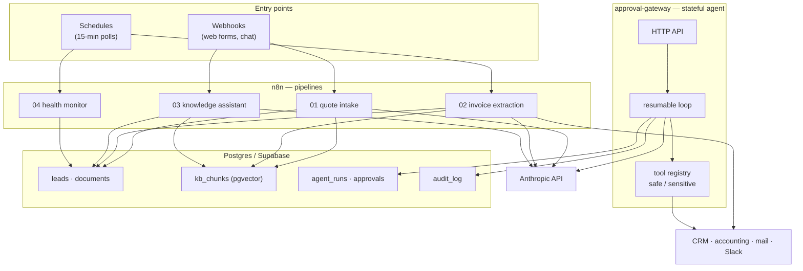

# Architecture

## The shape of the system



Two runtimes, chosen on one axis: **does the work outlive a single execution?**

n8n handles the pipelines — data arrives, passes through a fixed sequence of I/O, and
leaves. The canvas is genuinely the best documentation for that shape, and a
non-engineer can read it.

The approval gateway handles the one workload that does not fit: a run that stops
mid-loop and waits on a person.

## Why the agent loop is inside-out

The conventional loop — including the Anthropic SDK's `toolRunner` — assumes tool
execution returns within the lifetime of one call:

```
while (stop_reason === 'tool_use') {
  const result = await executeTool(call);   // ← assumed to be quick
  messages.push(result);
}
```

That assumption breaks the moment a tool call needs a human. The approver might answer
in twenty minutes, from their phone, hitting a different Worker isolate. There is no
stack frame to keep alive and nothing to await.

So the loop is turned inside out. Message history and partial results live in Postgres,
and "resume" is a *fresh invocation* that replays them:

| Conventional loop | This loop |
|---|---|
| State in local variables | State in `agent_runs.messages` |
| One process start to finish | Any isolate can pick up a parked run |
| Tool result awaited in place | Result written on resume, from the approval record |
| Human approval = block the thread | Human approval = a row transition |

The cost is real: every turn is a database round-trip, and the message history is
replayed to the API on each resume. That is the price of durability, and for a workload
measured in minutes-to-hours it is the right trade.

## The partial-tool-result problem

This is the subtlety that shapes the schema, and it is easy to get wrong.

The Anthropic API requires that a user turn answering tool calls contains a
`tool_result` for **every** `tool_use` block in the preceding assistant turn. Send
three tool calls, get three results back, in one message.

Now suppose one turn contains two calls — `get_job_status` (safe) and
`send_customer_email` (sensitive):

- The safe one can run immediately.
- The sensitive one has to wait for a human.
- But we cannot send *only* the safe result: the turn would be incomplete and the API
  rejects it.

Three options, and the reasoning matters more than the choice:

1. **Wait to execute anything until every gate clears.** Simple, but it delays reads
   that had no reason to wait and makes the approval summary less useful — the reviewer
   would benefit from seeing what the lookup returned.
2. **Set `disable_parallel_tool_use: true`.** Also simple, and defensible. Costs a
   round-trip per action.
3. **Execute the safe calls, park their results, and send everything together once the
   human decides.** More moving parts, no wasted latency, and the reviewer can be shown
   context.

This repo takes option 3. The parked results live in `agent_runs.pending_results`,
keyed by `tool_use_id`. Without that column a resume would re-execute the safe
calls — harmless for a read, but the same code path handles anything classified safe,
and "harmless today" is not a property worth depending on.

`test/agent.test.ts` pins the behaviour: *"runs safe siblings immediately and parks them
until the gated call is decided"* asserts both that only the sensitive call produced an
approval, and that the resumed turn carries both results.

## Where each concern lives

| Concern | Home | Why there |
|---|---|---|
| Output shape | Tool `input_schema` + `strict: true` | The API guarantees it; the parser never sees prose or a stray code fence |
| Business thresholds | `Parse & Score Risk` code node | Diffable, testable, changeable without re-evaluating a model |
| Arithmetic | `Reconcile Totals` code node | A language model is the wrong tool for addition |
| Risk classification | `src/tools.ts` registry | A prompt is a request; a registry entry is enforced |
| Retry policy | `src/retry.ts` + node-level `retryOnFail` | One place to reason about backoff and what is even retryable |
| Tenant isolation | RLS + explicit filters | Two mechanisms, one invariant — see [security.md](security.md) |
| Idempotency | Unique constraints + `Idempotency-Key` | Checking first loses the race; let the database arbitrate |

## Model configuration

`claude-opus-5`, `max_tokens: 16000`, `output_config.effort` tuned per workload:
`low` for extraction and retrieval-grounded answers, `medium` for document
transcription and the agent loop.

Three things that are easy to get wrong on this model generation:

- **No `temperature` / `top_p` / `top_k`.** They are rejected with a 400. Steer with
  prompting.
- **Thinking is on by default**, and `max_tokens` caps thinking *plus* response text —
  hence the generous ceiling. A budget sized tightly around the answer truncates.
- **A refusal arrives as HTTP 200** with `stop_reason: "refusal"`. Every call site here
  checks `stop_reason` before reading `content`; code that indexes `content[0]`
  unconditionally breaks on a refusal.
